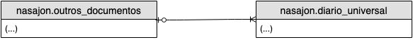

# Entidades

Conforme introdução do projeto, o diário unico conta com uma estrutura de banco otimizada para consultas (banco colunar) e destinada a eliminar ao máximo as tarefas de conciliação das diversas visões de uma mesma informação.

No entanto, o mesmo diário expõe seus serviços web utilizando-se de um nível de abstração que oculte (numa medida razoável) os detalhes de modelagem interna dos dados, e se aproxime ao máximo das entidades comuns num ERP de propósito genérico.

Segue portanto abaixo as entidades abstraídas pelo Diário unico, e a sua consequente equivalência na modelagem ER:

## Notas de Consumo de Serviços de Utilidades Públicas

TODO

## Outros Documentos

Abrange documentos não fiscais, porém que devem ser obrigatoriamente informados no SPED (na seção de demais receitas ou demais despesas). Exemplo:

* Cota Condominial
* Fatura de locação
* Receitas financerias auferidas no período
* Receitas auferidas de juros sobre o capital próprio
* etc

**Obs.:** Esta entidade abstrai o registro F100 do manual EFD Contribuições

~~Para mais informações (atributos e rotas), consulte a documentação da classe [OutrosDocumentosController](../Nasajon/AppBundle/ControllerOutrosDocumentosController.php).~~

### Modelo ER

* **nasajon.outros_documentos:** Entidade que irá abstrair os dados gerais (cabeçalho) de uma instância da entidade "Outros Documentos".
* **nasajon.diario_unico:** Itens do documento. Abrangendo tanto os itens em si, quanto os lançamentos contábeis e financeiros.