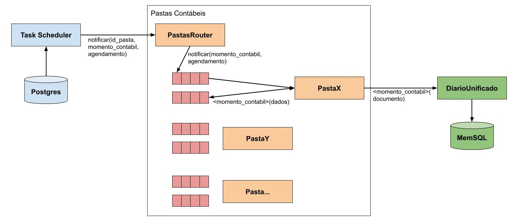
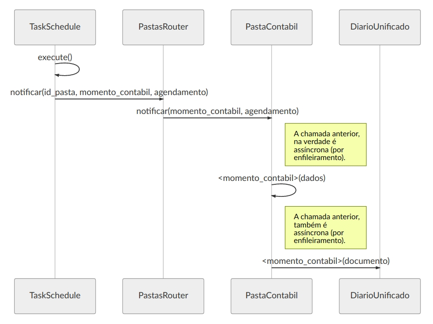

# Pastas Contábeis
O conceito formal das pastas contábeis pode ser consultado no seguinte [documento](https://docs.google.com/document/d/1og97Mk9_TB5jDplOIQnq2PczjSUmsvmTPdJrfnEZKC4/edit?usp=sharing).

No entanto, resumidamente trata-se de uma estratégia de desenvolvimento onde se deseja implementar cada processo, com implicações financeiras e contábeis, isoladamente. De maneira que a evolução do escopo coberto pelo produto é realizada de modo iterativo, permitindo também o reaproveitamento entre os processos.

Para exemplificar o conceito, espera-se a implementação de pastas como:

* NFSe
* Retenção de ISS

Onde a pasta de NFSe implementará toda a lógica necessária para a apropriação (previsão, quitação, etc) de uma NFSe, porém utilizará a pasta de Retenção de ISS "em cascata", para tratar da retenção de impostos.

## Arquitetura
O conceito de pasta contábil foi concebido com a intenção de permitir a automação máxima dos processos contábeis, financeiros e fiscais, principalmente daqueles com natureza recorrente.

Assim, posto que sua natureza gira em torno da realização de cálculos monetários, optou-se pela linguagem python, conforme [estudo realizado](https://docs.google.com/presentation/d/1erSh1YB70ayoYSoWtB40JHS2UtCj6TtPyL3MmeC2tVI/edit?usp=sharing).

Além disto, em se tratando do objetivo da automação, os processos de cada pasta poderão ser executados enquanto bots (ou jobs), de maneira que sua implementação tem como requisito a possibilidade de execução enfileirada.

Mesmo assim, os requisitos funcionais dos projetos que se utilizarem das pastas, demandam a execução síncrona ou sob-demanda dos processos implementados nas pastas. Então, também é requisito a exposição das lógicas implementadas por meio de APIs Rest.

Portanto, as pastas serão implementadas enquanto serviços consumidores de fila, expostos também via uma aplicação django no papel de wrapper.

Resumindo: A opção pelo conceito de pastas contábeis está na escalabilidade de negócio, isto é, é mais fácil evoluir o escopo coberto pelo sistema por meio de pequenas adições de peças de software que contenham inteligência específica e não generalizada. Logo, diminui-se o risco de o esforço para criação de uma lógica genérica se tornar um problema pela falta de contemplação de especificidades imprevistas.

### Interface pública
Segue breve descrição dos métodos principais da interface pública genérica de uma pasta contábil:

#### simular(dados)
Realiza os lançamentos em estado simulado do fato contábil correspondente (útil para realização de orçamentos).
Obs.: Trata-se de um callback para o RabitMQ.

#### simular(dados)
Realiza o faturamento de algum compromisso e gera lançamentos em estado apropriação do fato contábil correspondente (útil para realização de orçamentos).
Obs.: Trata-se de um callback para o RabitMQ.

#### escriturar_futuro(dados)
Realiza os lançamentos em estado previsto do fato contábil correspondente.
Obs.: Trata-se de um callback para o RabitMQ.

#### apropriar(dados)
Realiza os lançamentos de apropriação do fato contábil correspondente.
Obs.: Trata-se de um callback para o RabitMQ.

#### quitar(dados)
Realiza os lançamentos de quitação do fato contábil correspondente.
Obs.: Trata-se de um callback para o RabitMQ.

#### cancelar(dados)
Realiza lançamentos (de estorno), e/ou remove lançamentos futuros, com o fim de promover o cancelamento do fato contábil correspondente.
Obs.: Trata-se de um callback para o RabitMQ.

#### notificar(momento: MomentoEnum, agendamento: str)
Método da classe abstrata responsável por recuperar os dados necessários, e a execução da lógica de negócio, de acordo com o momento contábil passado (exemplo: no MomentoEnum.ESCRITURACAO, será preciso recuperar dados como a média do valor, com o vim de prever os próximos lançamentos).

### Diagrama de componentes (com fluxo básico)


### Diagrama de sequência


### Segue descrição dos componentes dos diagramas acima:

#### TaskSchedule
Controlador de agendamento dos compromissos recorrentes, parametrizados via banco. Por exemplo, no caso do cadastro de um compromisso a pagar (ex: conta de energia), mensalmente este job irá disparar a notificação a devida pasta contábil, para atualizar a escrituração antecipada (para os próximos 12 meses).

#### PastasRouter
Classe da camada de controle das pastas contábeis, capaz de identificar a correta implementação da pasta contábil, de acordo com o identificador de pasta parametrizado no banco de dados (campo string).

Este mesmo componente será responsável por enfileirar a notificação de processamento pendente, para a pasta contábil de interesse.

#### PastaContabil
Uma das possíveis especializações da classe abstrata "PastaContabil", a qual deve ser capaz de:

1. Consumir a respectiva fila de notificações.
2. Recuperar do diário (e/ou postgres, isto é , do banco de controle) os dados necessários ao processamento do momento contábil recebido
3. Enfileirar a execução do momento contábil recebido, já com os dados necessários.
4. Executar (assincronamente) o momento contábil recebido.

É nesta camada que reside a maior parte da inteligência de negócio da aplicação.

#### DiárioUnico
Componente representando a API do diário unico (centralizador dos fatos contábeis, financeiros e fiscais pertinentes ao negócio.

## Ambiente de desenvolvimento

### Iniciando os serviços

#### Django
```shell
docker-compose up -d app
```

#### RabbitMQ
```shell
docker-compose up -d rabbitmq
```

#### Celery
```shell
docker-compose up -d celery
```

### Banco de Dados

O projeto PastasContábeis depende tanto do banco colunar (MemSQL<s>, ou MariaDB</s>), quanto do banco tradicional (Postgres).

Assim, para inicializar os respectivos bancos, siga os passos abaixo (por banco):

#### MemSQL

1. Inicie o banco em si:

```shell
docker-compose up -d memsql
```

2. Conecte o no banco por meio de um cliente sql qualquer (como o [DBeaver](https://dbeaver.io/)), utilizando as credencias a seguir:
   1. Host: Seu IP
   2. Database: nasajon
   3. User: root
   4. Password: Sem senha
   5. Driver: MySQL ou MariaDB

3. Execute o comando abaixo no banco "nasajon":

```sql
SET PASSWORD FOR 'root' = PASSWORD('nasajon');
```

4. Configure o arquivo ```common.env``` de acordo com as credenciais abaixo:
   1. Host: memsql
   2. Database: nasajon
   3. User: root
   4. Password: nasajon

Obs.: Os passos 2, 3 e 4, só deverão ser realizados na primeira execução do banco de dados.

#### MariaDB ColumnStore

1. Inicie o banco em si:

```shell
docker-compose up -d maria_diario
```

2. Execute os dois comandos abaixo dentro do container para habilitar o login do usuário 'root' por fora do container e para criar o banco de dados inicial.
(Obs: adapte o comando abaixo conforme desejar alterar o password e nome do usuario root)

```shell
docker exec pastascontabeis_maria_diario_1 mysql --user=root --password='nasajon' -e "GRANT ALL PRIVILEGES ON *.* TO 'root'@'%' IDENTIFIED BY 'nasajon' WITH GRANT OPTION";
docker exec pastascontabeis_maria_diario_1 mysql --user=root --password='nasajon' -e "create database nasajon";
```

3. Configure o arquivo ```common.env``` de acordo com as credenciais abaixo:
   1. Host: maria_diario
   2. Database: nasajon
   3. User: root
   4. Password: nasajon

Obs.: Os passos 2 e 3, só deverão ser realizados na primeira execução do banco de dados.


#### Controle de Versão do Banco de Dados

O controle de versão do banco de dados é realizado por meio do mecanismo de migrations do DJango, o qual divide os arquivos de migração por aplicação DJango (a saber, o DJango divide um projeto web em pacotes reutilizáveis chamados de aplicações, e o projeto PastasContabeis contém uma aplicação específica para o diário unico).

Assim, a evolução do banco de dados está também dividida pela aplicação de interesse:

##### Diario Unico

Os migrations do diário unico estão contidos no diretório:

```shell
diario_unico/migrations
```

Para executar de fato as migrações, utilize o comando:

```shell
docker-compose up migration_diario
```


##### Criando um novo migration

A mecânica de criação de um novo migration é a mesma independentemente da aplicação desejada, portanto siga os passos abaixo, ajustando o nome da aplicação desejada:

_Obs.: O Django dá preferência ao controle das migrations por meio de seu próprio ORM, e não por meio da escrita direta dos comandos SQL). Contudo, como a Nasajon optou pela não utilização do ORM (e para manter similaridade com outras arquitetura da empresa, como: PHP + Symfony), foi utilizado o modelo customizado do DJango, cuja explicação pode ser encontrada [aqui](https://www.endpoint.com/blog/2016/09/17/executing-custom-sql-in-django-migration)._

###### Maneira manual

1. Faça uma cópia do último arquivo de migração do diretório
2. Altere seu nome conforme desejado
3. Altere o vetor ```dependencies``` do novo arquivo de migração, indicando que esta nova migração dependende do último migration anteriormente existente (o DJango utiliza o vetor de dependências para ordenar a execução dos migrations).
4. Altere o vetor ```operations``` do novo arquivo de migração, adicionando as queries que devem sem executadas.

###### Maneira "automática" (usando o manage do DJango)

1. Execute o comando abaixo:

```shell
python3 manage.py makemigrations <nome_aplicacao> --empty -n <nome_migration>
```

2. Altere o vetor ```operations``` do novo arquivo de migração recém criado, adicionando as queries que devem sem executadas.

Obs.: Neste segundo modo de criação dos migrations, o DJango se encarrega de preencher o vetor ```dependencies```.

# Diario Unico

Serviço para lançamentos genéricos no diário unico.

A ideia é que este serviço receberá objetos (json) alinhados com o modelo ER para persistência no banco de dados do diário unico, bem como responderá a chamadas de retrieve dos dados. Basicamente se trata de uma camada intermediária entre o banco e as aplicações (ou serviços) especializadas por área de negócio. Exemplo:

O projeto MeuCondominioAPI irá implementar serviços de acordo com a realidade da administração condominial, porém irá transformar os dados para a realidade do diário unico, antes de sua persistência, a qual será feita pelo serviço do Diário Unico.

## Documentação do Projeto

### Modelo ER

[TODO] Adicionar link para modelo ER

#### Plano de contas

Abaixo consta o modelo ER para persistência dos planos de conta referenciais suportados pelo Diário Unico:


#### Plano de contas virtual

Abaixo consta o modelo ER para persistência dos planos de conta virtuais utilizados pelos clientes, isto é, que permitirão ao cliente customizar a visualização de suas contas:


### Abstração de dados

Segue link para documentação explicativa sobre o modo de abstração dos dados na modelagem do diário unico (respondendo perguntas como, por exemplo: "Como tratar cenários orçamentário?"):

[Apresentação Geral](docs/apresentacao_geral.md)

### Entidades Tratadas

[Apresentação das Entidades Tratadas pelo Diário Unico](docs/entidades.md)

### Planos de contas

Para a contabilização automática, os lançamentos no diário unico deverão ser feitos já com a descrição das partidas contábeis (débito/crédito, valor, data e histórico).

Além disto, para permitir a distriubição de funcionalidades contábeis relevantes de modo pré-fabricado (incluindo-se o que tange à semântica dos dados; por exemplo: balancetes e demonstrativos de resultados), se faz necessária a fixação de planos de contas de referência (vindos de fábrica).

Assim, segue abaixo a documentação referênte a cada plano de contas distribuído de fábrica.

[Plano de contas para um condomínio (ponto de vista do próprio condomínio)](docs/plano_contas_condominio.md)

**Obs.:** Esta estratégia não veda ao cliente a possibilidade de configurar seu próprio plano de contas. Somente que o plano do cliente será uma interpretação, ou forma de visualização personalizada, baseada no plano de referência:

* De-Para de contas
* Abertura de contas por meio de uma dimensão qualquer
* Geração automática de contas, de acordo com regras pré-definidas, como:
 * Abertura para um grupo seleto de fornecedores, atribuindo as excessões a contas genéricas como _"Outros fornecedores"_
 * Regra de codificação automática das contas dinâmicas (permitindo também de fixar a codificação de algumas contas de maior importância)

# Condominio Jobs

Repositório destinado ao versionamento das atualizações de banco de dados para a execução dos JOBs do projeto CondomínioWEB (repositório dos JOBs: https://github.com/Nasajon/CondominioJOBS).

Segue a relação de escopos dos JOBs cobertos:

## ContabilidadeAPI
MOPE 63 - Controle de relatórios contábeis, análise de fechamento contábil, etc

Módulo destinado ao controle da geração de relatórios contábeis (gerenciais ou fiscais). A ideia é automatizar a geração e remessa destes relatórios, conforme configuração do módulo.

## ContratosPagamentosAPI
API para persistência das entidades necessárias ao controle de pagamentos recorrentes (ver processo 572 da MOPE: "Contratos e Pagamentos a Fornecedores").

[Acesse a documentação](docs/contratos_pagamentos_api.md)

## FaturamentoAPI
Módulo destinado ao controle de cobranças recorrentes e faturamento de contratos.

[Acesse a documentação](docs/faturamento_api.md)

## FinanceiroAPI
MOPE 64 (Finanças) - Controle de contas a pagar e receber, conciliação bancária, etc.

[Acesse a documentação](docs/financeiro_api.md)
