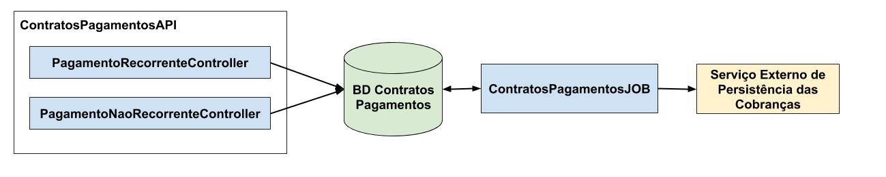

# ContratosPagamentosAPI

## Objetivo

Serviço destinado ao controle de pagamentos recorrentes (ver processo 572 da MOPE: "Contratos e Pagamentos a Fornecedores")

Por hora, este módulo será responsável apenas pela geração das previsões de contas a pagar recorrentes. No futuro, pode ser usado para a geração de compromissos financeiros a pagar recorrentes (sem documentação de entrada, como por exemplo, pagamentos via transferência bancária).

Este módulo porém não tem por objetivo persistir os dados referentes aos pagamentos gerados, antes os dados gerados serão persistidos via chamadas REST em outras camadas (cuja comunicação será parametrizada conforme desejado).

## Diagrama global de componentes

Por diagrama global quer se designar um diagrama capaz de exceder o escopo do repositório atual, localizando a solução atual em seu respectivo contexto:

### ContratosPagamentosAPI

Módulo correspondente ao repositório atual, responsável pelas operações CRUD das pagamentos recorrentes ou não recorrentes, a serem faturados "a favor" de um participante.

É importante destacar porém que os chamados "pagamentos não recorrentes", neste contexto, não se referem a contas a pagar avulsas, mas sim a parcelas de ocorrência eventual a serem faturadas junto a algum compromisso (contrato, por exemplo) já controlado pelo módulo. Isto é, um contrato pode reger valores ou regras para cobrança de eventos de ocorrência variável, sendo a cobrança destes sempre realizada pelo próprio faturamento do contrato.

### BD ContratosPagamentos

O solução deve ser vista como um aplicativo independente, cujo escopo se destina exclusivamente ao pagamento de valores conforme parametrizado (o que demandará uma estrutura de banco de dados própria).

A longo prazo, se objetiva também a implemetação de interface de usuário para administração dos compromissos a pagar.

### ContratosPagamentosJOB

Módulo concebido para operar enquanto tarefa periódica, verificando a necessidade de gerar e/ou atualizar o lançamento de valores a pagar, isto é, gerando o documento de saída apropriado (nota de serviço de utilidades públicas, por exemplo), e invocando o "Serviço Externo de Persistência das Cobranças" para gravar ou atualizar a documentação gerada.

### Serviço Externo de Persistência das Cobranças

Este módulo na verdade não existe com este nome. Antes, trata-se de uma designação para um provedor de serviços de persistência de documentos.

A ideia, no projeto Condomínio WEB, é que este módulo seja cumprido pelo projeto [DiárioUnico](https://github.com/Nasajon/DiarioUniversal), mas pode ser desejada a implementação futura de um serviço de compatibilidade para com o ERP 2.

## Modelo ER

O escopo do repositório atual está restrito ao pagamento de compromissos recorrentes. Assim sendo, entidades como os fornecedores e estabelecimentos envolvidos não estarão modelados no banco do aplicativo (apenas uma chave condidata de domínio será gravado no banco de dados para referenciar estas entidades, e permitir integrações com outras aplicações, mesmo que de terceiros - a chave candidata será a princípio o CNPJ). Segue modelo ER:

**Obs.:** As entidades "esmaecidas" são um planejamento para médio ou longo prazo.