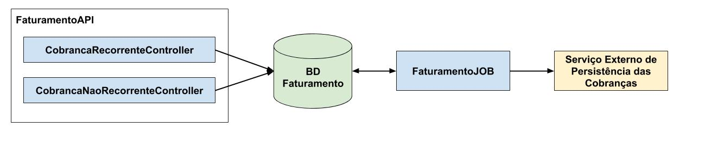
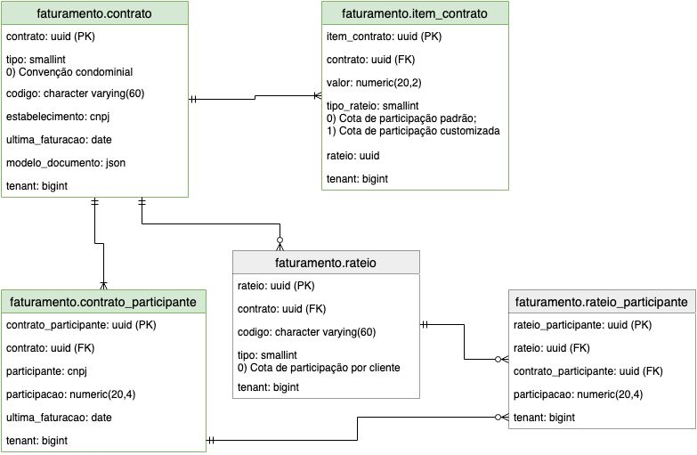

# FaturamentoAPI


## Objetivo

Serviço destinado ao controle do faturamento de compromissos recorrentes (exemplo contratos e/ou cotas condominiais).

Existe também o objetivo futuro de predição de faturamento e/ou simples lançamento de valores recorrentes a receber (mesmo que desprovídos de da formalização de compromissos).

Este módulo porém não tem por objetivo persistir os dados referentes aos faturamentos gerados, antes os dados gerados serão persistidos via chamadas REST em outras camadas (cuja comunicação será parametrizada conforme desejado).

## Diagrama global de componentes

Por diagrama global quer se designar um diagrama capaz de exceder o escopo do repositório atual, localizando a solução atual em sem respectivo contexto:



### FaturamentoAPI

Módulo correspondente ao repositório atual, responsável pelas operações CRUD das cobranças recorrentes ou não recorrentes, a serem faturadas "contra" os participantes.

É importante destacar porém que as chamadas "cobranças não recorrentes" neste contexto, não se referem a contas a pagar avulsas, mas sim a parcelas de ocorrência eventual a serem faturadas junto a algum compromisso (contrato, por exemplo) já controlado pelo módulo. Isto é, um contrato pode reger valores ou regras para cobrança de eventos de ocorrência variável, sendo a cobrança destes sempre realizada pelo próprio faturamento do contrato (e eventualmente passível de medição).

### BD Faturamento

O solução de faturamento deve ser vista como um aplicativo independente, cujo escopo se destina exclusivamente ao faturamento de valores conforme parametrizado (o que demandará uma estrutura de banco de dados própria).

A longo prazo, se objetiva também a implemetação de interface de usuário para administração e medição dos contratos a faturar.

### FaturamentoJOB

Módulo concebido para operar enquanto tarefa periódica, verificando a necessidade de gerar e/ou atualizar o faturamento de valores a receber, isto é, gerando o documento de saída apropriado (cota condominial, nota de serviço, etc), e invocando o "Serviço Externo de Persistência das Cobranças" para gravar ou atualizar a documentação de cobrança gerada.

### Serviço Externo de Persistência das Cobranças

Este módulo na verdade não existe com este nome. Antes, trata-se de uma designação para um provedor de serviços de persistência de documentos de cobrança.

A ideia, no projeto Condomínio WEB, é que este módulo seja cumprido pelo projeto [DiárioUnico](https://github.com/Nasajon/DiarioUniversal), mas pode ser desejada a implementação futura de um serviço de compatibilidade para com o ERP 2.

## Modelo ER

O escopo do repositório atual está restrito ao faturamento de compromissos recorrentes. Assim sendo, entidades como os cliente e estabelecimentos envolvidos não estarão modelados no banco do aplicativo (apenas uma chave condidata de domínio será gravado no banco de dados para referenciar estas entidades, e permitir integrações com outras aplicações, mesmo que de terceiros - a chave candidata será a princípio o CNPJ). Segue modelo ER:



**Obs.:** As entidades "esmaecidas" são um planejamento para médio ou longo prazo.

## Inicializar o banco de dados

- Rodar o comando ```docker-compose up -d postgres```

- Rodar o comando ```docker-compose up migration```
